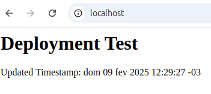
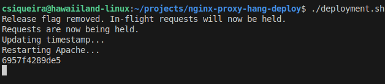
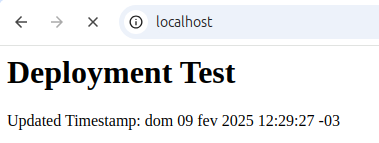
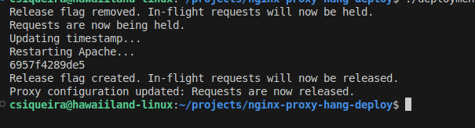
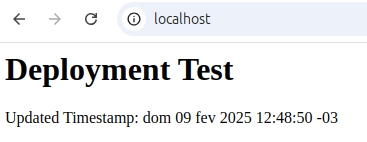

# nginx-proxy-hang-deploy

This project demonstrates a zero-downtime deployment strategy using Docker, Nginx Proxy Manager, Apache, and OpenResty. It leverages a custom "hold" container (based on OpenResty) to temporarily hold incoming requests while Apache is updated. When the deployment completes, held requests are released via a client-side redirect.

  
First we have the Apache webserver hosting a page with a timestamp.

  
We start the deployment script.

  
Connections to the server start to be handled by the hold container, hanging them.

  
The deployment script finishes executing.

  
The requests that were previously hanging will complete to the new container.

## TLDR

- clone: ```git clone https://github.com/csiqueirasilva/nginx-proxy-hang-deploy```
- start containers in cloned repository: ```docker-compose up -d```
- start nginx proxy manager configuration: ```./proxy-startup.sh```
- run sample deployment: ```./deployment.sh```

##  Overview
The setup consists of three primary services defined in a Docker Compose file:

- proxy: Runs Nginx Proxy Manager to manage proxy host configurations via an API.
- apache: Runs an Apache HTTP Server that serves your static website content (for example, an HTML file).
- hold: Runs an OpenResty container configured with custom Lua logic.

This container holds incoming requests by polling for a release flag and, when the flag is detected, issues a client-side HTTP 302 redirect to Apache.

This approach simulates a deployment where:

- The proxy is temporarily configured to send new requests to the hold container.
- The Apache service is updated (for example, by modifying the HTML file and restarting the container).
- Once Apache is ready, the hold container detects the release flag and redirects clients to Apache, ensuring a seamless transition with no downtime.

## Prerequisites

- Docker and Docker Compose must be installed on your machine.
- Ports 80, 81, 8080, and 9999 should be available on your host.
- Basic knowledge of Docker, Nginx, Apache, and Lua (for the OpenResty configuration) is helpful.

## Installation 

Clone the repository: ```git clone https://github.com/csiqueirasilva/nginx-proxy-hang-deploy```

Enter the cloned directory and start the containers using Docker Compose: ```docker-compose up -d```

## Usage

Initialize the Proxy Host:

### Run the proxy-startup.sh script

This script retrieves an API token from Nginx Proxy Manager and creates a proxy host entry for this example (using "localhost" as the domain). 

Command: ```./proxy-startup.sh```

### Simulate a Deployment

Run the deployment.sh script to see the deployment process in action.

The script performs the following steps: 

a. Hold Requests: The proxy is reconfigured to forward incoming traffic to the hold container. 

b. Deployment Actions: The Apache website is updated (for example, a timestamp is updated in the HTML file) and the Apache container is restarted concurrently. 

c. Wait for Apache Health: The script waits until Apache is fully ready to serve requests (to prevent a 502 error). 

d. Release Held Requests: A "release.flag" file is created in the shared volume. The hold container's Lua script polls for this flag and, when detected, issues an HTTP 302 redirect to Apache. 

e. Reconfigure Proxy: Finally, the proxy configuration is updated so that new requests are directed directly to Apache. 

Command: ```./deployment.sh```

## How It Works

### Initial Setup:

Running "docker-compose up -d" starts all three services.
The proxy (Nginx Proxy Manager) manages the proxy host, Apache serves your site, and the hold container is ready to delay requests.

### Proxy Startup:

The proxy-startup.sh script initializes the proxy configuration.
It saves the API token and proxy host ID to the files api_token.txt and proxy_id.txt, respectively.

### Holding Requests:

During deployment, the proxy is reconfigured to forward requests to the hold container.
The OpenResty configuration in the hold container includes a Lua script that continuously polls for the presence of the file /tmp/release.flag.
Once the flag is detected, the Lua script constructs a redirect URL and issues a client-side HTTP 302 redirect to Apache.

In particular, step 2 of the deployment.sh script should contain the actions taken in the deployment (eg: run database scripts, deploy new containers, do version control pull, etc).

### Deployment and Release:

While Apache is updated (its HTML is changed and the container is restarted), the hold container delays processing.
After confirming that Apache is healthy, the deployment.sh script creates the release flag and updates the proxy configuration.
The hold container then redirects clients to Apache, ensuring a seamless user experience.

### Client-Side Redirect:

The Lua code in the hold container uses ngx.redirect() to send a 302 response.
This ensures that browsers re-request the updated resource from Apache.

## Troubleshooting

- 502 Proxy Error: This error may occur if Apache is not ready when held requests are released. Ensure that the deployment script waits for Apache to become healthy before releasing the hold.

- Configuration Not Reloading: OpenResty (and Nginx) do not automatically reload the configuration when nginx.conf is updated. After making configuration changes, either reload the configuration manually with a command like: docker exec hold nginx -s reload or restart the container.

- Logging: Check container logs for errors or debugging messages: docker logs <container_name>

## Takeaway

Although this sample shows how the process can be done, ideally it should be created using a mature pipeline environement like Azure Devops.

## License

This project is licensed under the MIT License. Feel free to use and modify it as needed.

## Acknowledgements

- [Nginx Proxy Manager](https://nginxproxymanager.com/)
- [OpenResty](https://openresty.org/)
- [Docker](https://www.docker.com/)
- [Apache HTTP Server](https://httpd.apache.org/)